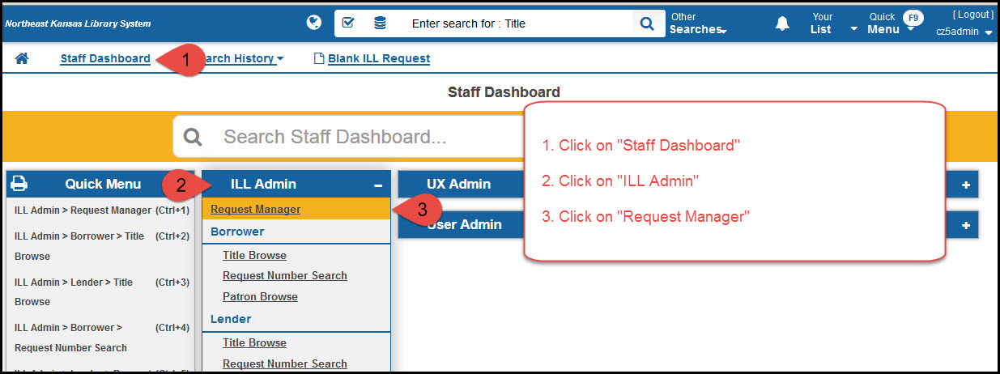
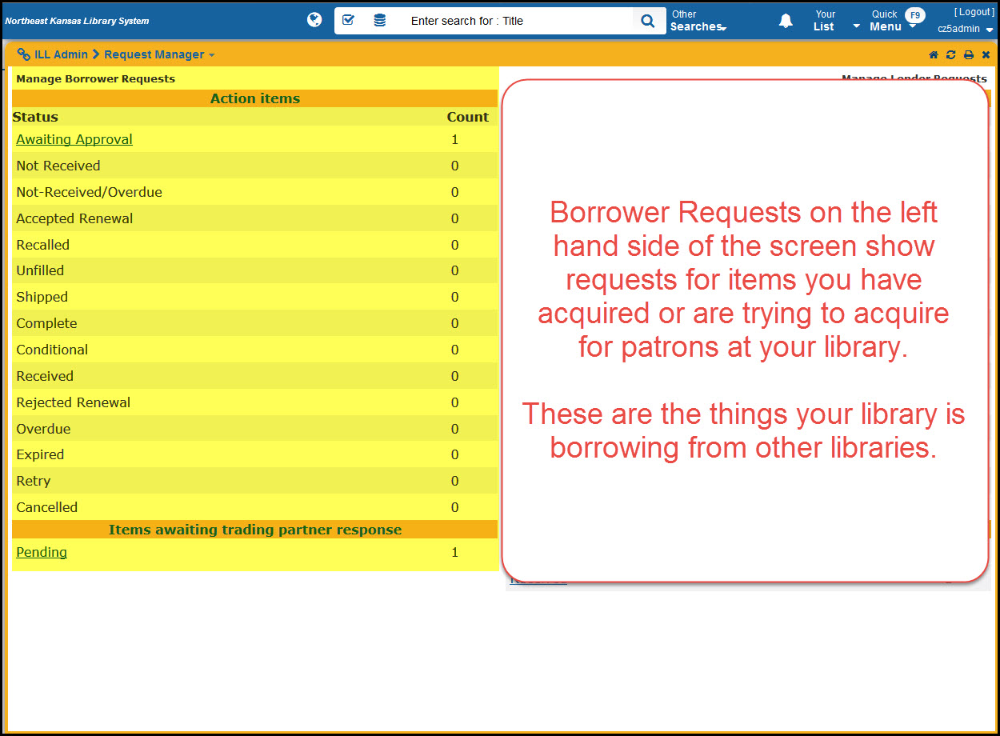
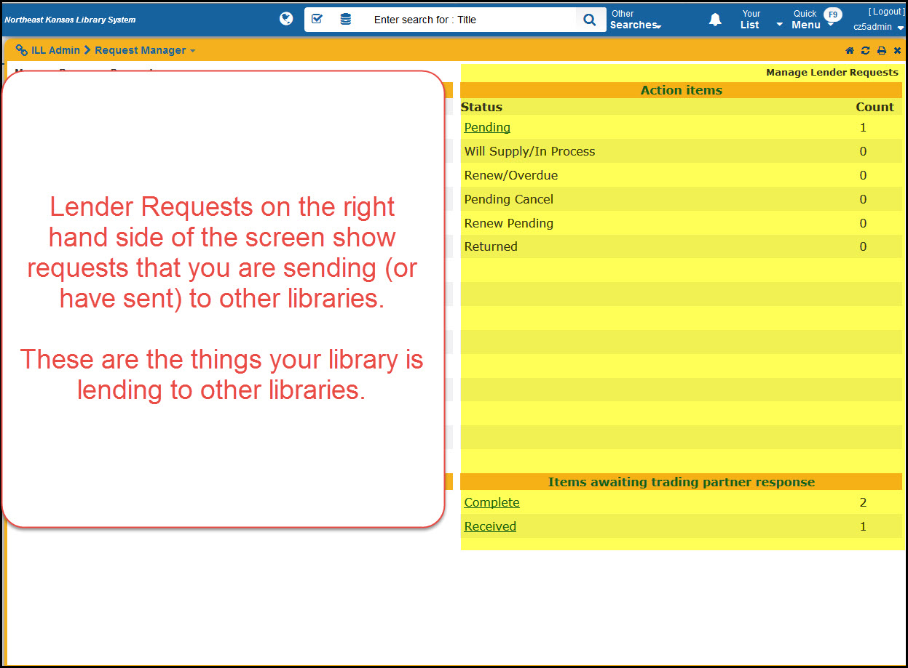

Managing requests
=================

All of the request management is done through “Request Manager” module.
To get there, go to the staff dashboard, click on ILL Admin, then
Request manager.

   Request manager

Borrower Requests appear on the left, Lender Requests appear on the
right.

   Borrower requests

   Lender requests
