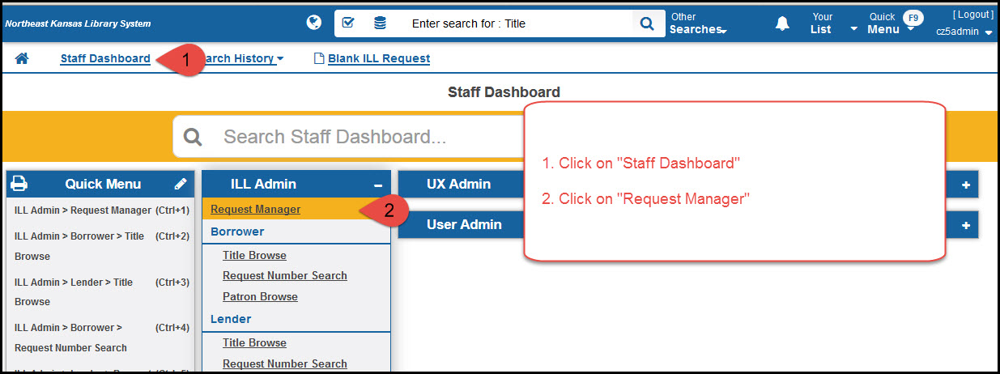
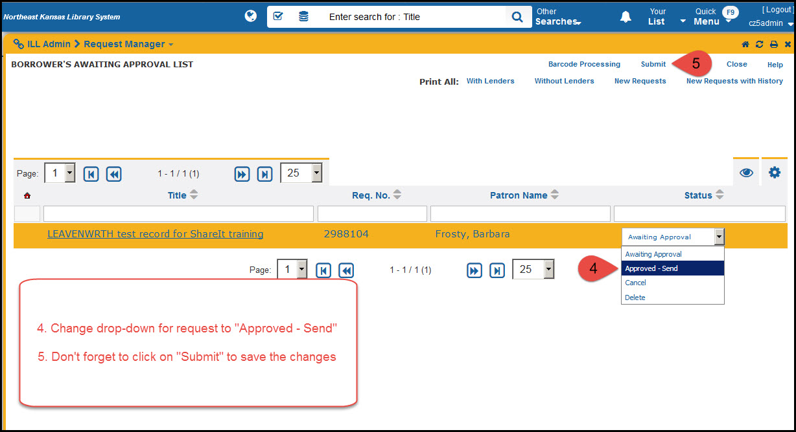

Search and request
==================

Search
------

Search box
~~~~~~~~~~

The search box appears at the top of every screen in ShareIt.

   Search box

Catalog selection
~~~~~~~~~~~~~~~~~

The search will automatically search the catalogs selected by default
for your library. The defaults can be changed from the “Search
resources” menu on the staff dashboard.

.. figure:: images/110.jpg
   :alt: Catalog search defaults

   Catalog search defaults

Search results
~~~~~~~~~~~~~~

.. figure:: images/120.jpg
   :alt: Search results

   Search results

Detailed results 1
~~~~~~~~~~~~~~~~~~

Clicking on “View details” will give you more detailed results.

.. figure:: images/130.jpg
   :alt: Details 1

   Details 1

Detailed results 2
~~~~~~~~~~~~~~~~~~

Clicking on the cover of an item will give you even more details.

.. figure:: images/140.jpg
   :alt: Details 2

   Details 2

Requests
--------

Basic request
~~~~~~~~~~~~~

Once you find a title you want to borrow, click on the “Request this
item” button to initiate a request. This will bring up a request form:

.. figure:: images/150.jpg
   :alt: Request form

   Request form

Once a request has been submitted, `it must be approved`_ in the
“Request manager” module.

Requesting multi-copies
~~~~~~~~~~~~~~~~~~~~~~~

If you need to borrow multiple copies of a title (maybe for a book-club
or classroom use) you can request multiple copies of a title.

.. figure:: images/160.jpg
   :alt: Multi-copy request form

   Multi-copy request form

Once a request has been submitted, `it must be approved`_ in the
“Request manager” module.

Approve requests after they are made
~~~~~~~~~~~~~~~~~~~~~~~~~~~~~~~~~~~~

After requests have been made, staff need to approve the requests. The
approval process is built into the system because some libraries allow
patron initiated ILL requests through ShareIt. The approval process
allows staff to review any requests before they are sent to other
libraries to make sure the ILL request are in line with the borrowing
library’s ILL policies.

   Approval 1-2

.. figure:: images/180.jpg
   :alt: Approval 3

   Approval 3

   Approval 4-5

.. _it must be approved: #approve-requests-after-they-are-made
